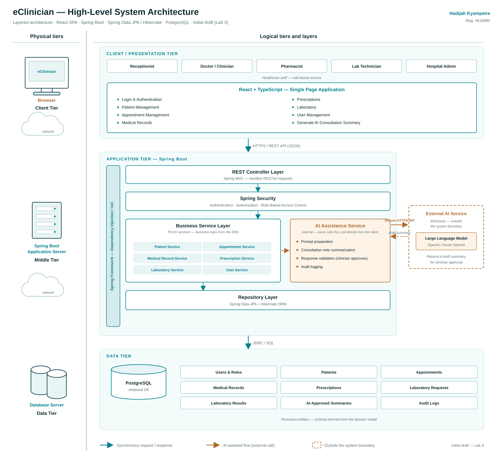
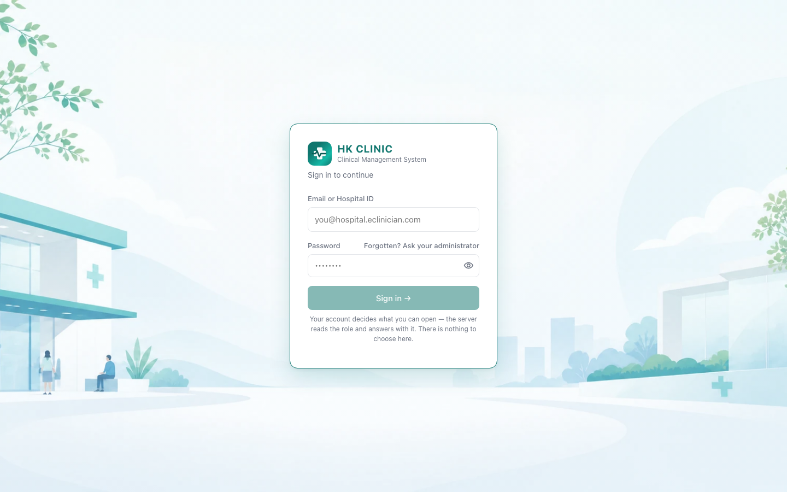
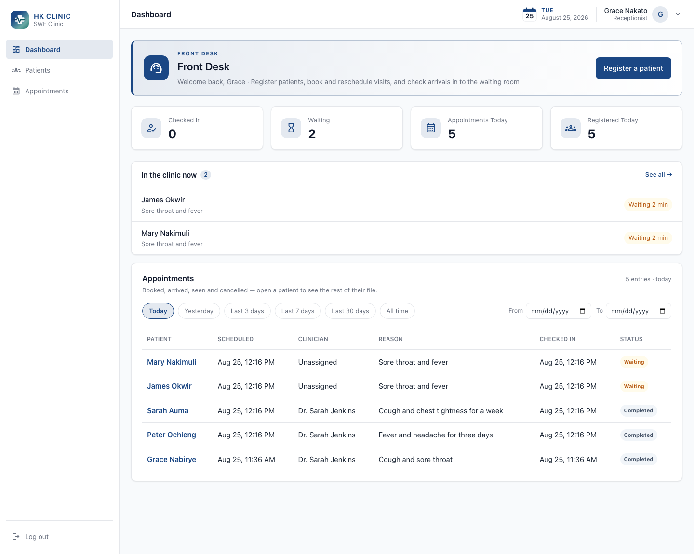
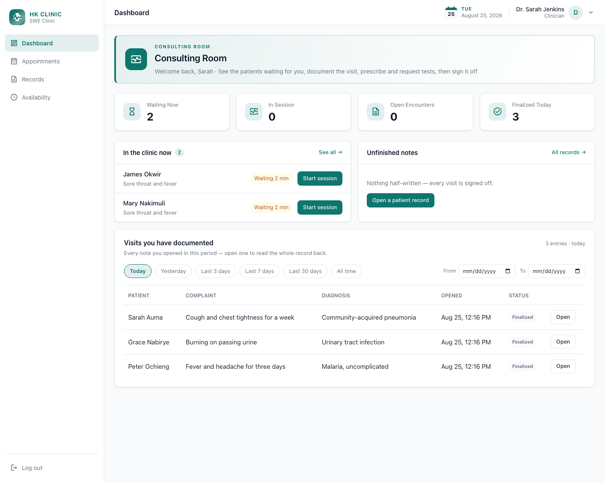
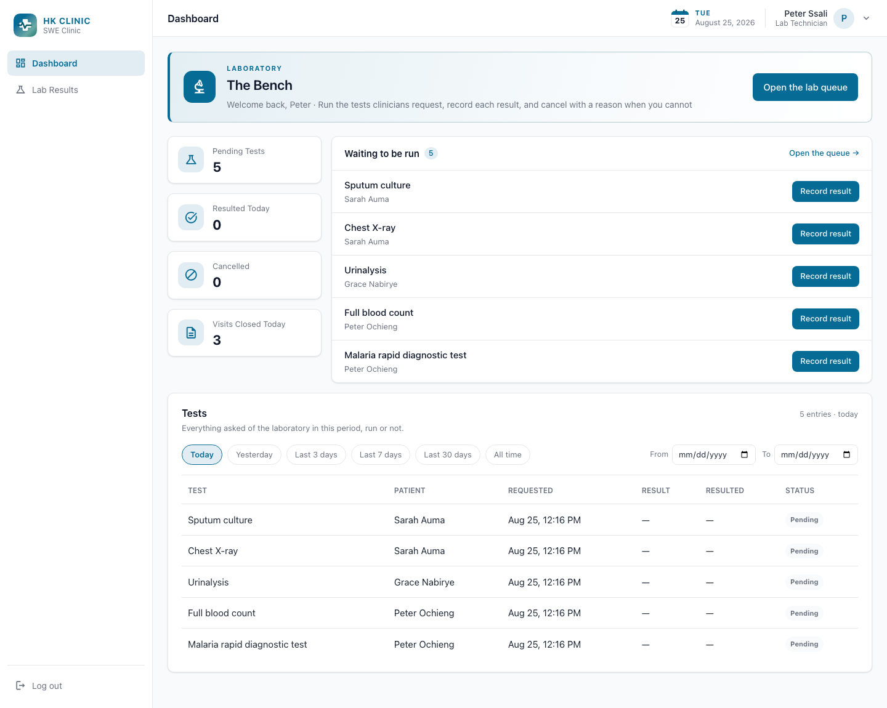
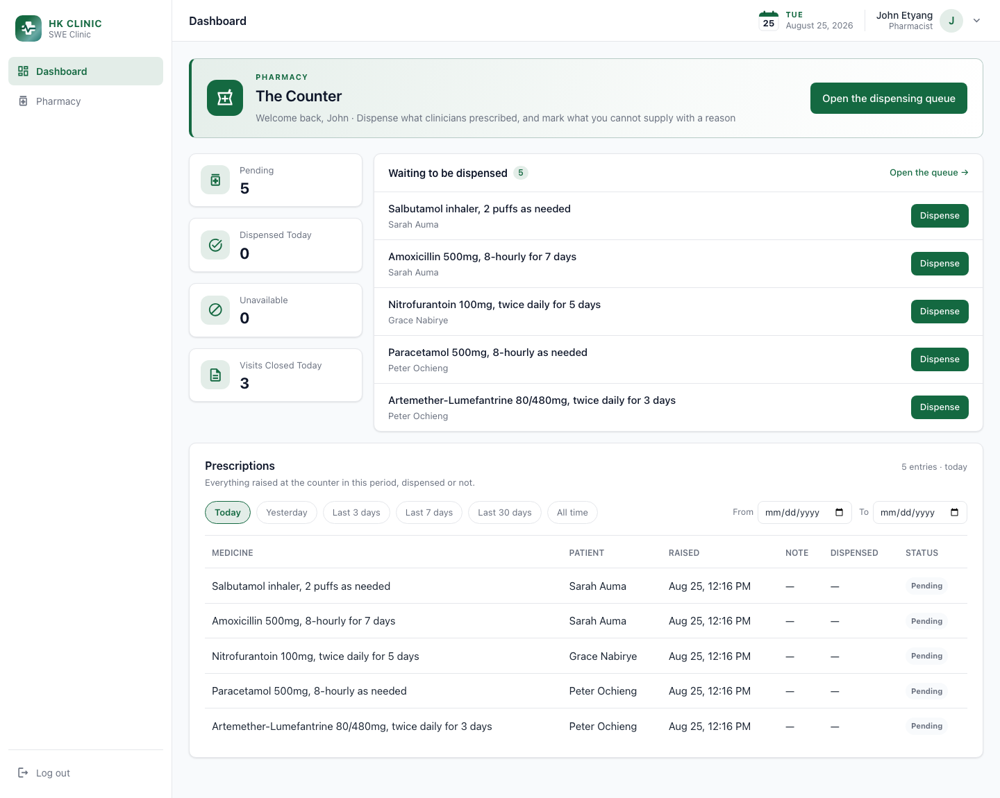
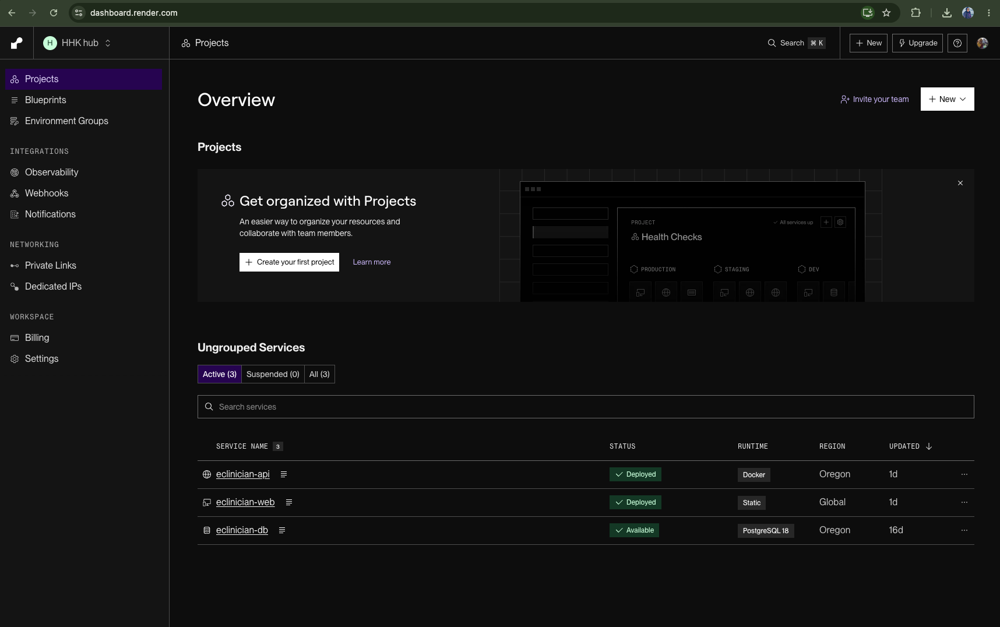

# eClinician

A multi-tenant clinic management system: one deployment serving many clinics, covering the
outpatient visit from check-in to dispensing.

**[Open the app](https://eclinician-web.onrender.com/login)** ·
[API docs](https://eclinician-api.onrender.com/swagger-ui.html) ·
[health check](https://eclinician-api.onrender.com/api/health) ·
[demo script](docs/demo-script.md) · [presentation guide](docs/presentation.md)

- The free tier sleeps after 15 minutes of no traffic, so the first request takes ~90
  seconds to wake it.
- Cmd-click (Ctrl-click) links here — GitHub will not open them in a new tab on its own.

## Sign in

Password for every account: **`demo1234`**. No role picker — the role lives on the account
and the API enforces it.

| Role | Email | Opens |
|---|---|---|
| Receptionist | `hkreceptionist@hkclinics.com` | Patients · Appointments |
| General Practitioner | `hkdoctor@hkclinics.com` | Assigned queue · Records |
| Dentist · Pediatrician · Optometrist · OB-GYN | `hkdentist@` · `hkpediatrician@` · `hkoptometrist@` · `hkobgyn@` — all `@hkclinics.com` | Assigned queue · Records |
| Lab Technician | `hklabtech@hkclinics.com` | Lab Results |
| Pharmacist | `hkpharmacy@hkclinics.com` | Pharmacy |
| Hospital Administrator | `hkadmin@hkclinics.com` | Staff · Clinic settings · oversight |
| Platform Super Admin | `root@eclinician.com` | Hospital console — and no patient data |

---

# Project walkthrough

Where each artefact lives, and the one or two things that matter about it.

## A. Documentation and design

### A.1 · Vision

- **[eClinician-Vision.pdf](docs/vision/eClinician-Vision.pdf)** — problem, product
  position, stakeholders, scope, features, assumptions. Also
  [.docx](docs/vision/eClinician-Vision.docx).

### A.2 · SRS and use-case model

- **[eClinician-SRS.pdf](docs/srs/eClinician-SRS.pdf)** — actors, use-case model, every use
  case with flows and pre/postconditions. Written before any code. Also
  [.docx](docs/srs/eClinician-SRS.docx) · [slides](docs/srs/eClinician-Requirements-Presentation.pptx).
- **[docs/as-built.md](docs/as-built.md)** — specification against implementation, the
  non-functional requirements the code answers, and two rules enforced more strictly.

### A.3 · Architecture and UML

- **[System-Architecture.pdf](docs/architecture/eClinician-System-Architecture.pdf)** —
  drivers, style, components, decisions, quality attributes.
- **[docs/diagrams/](docs/diagrams/)** — use case, VOPC, sequence, collaboration; every one
  inline on a single page, each with its editable `.drawio` source.



- Three tiers: React SPA → Spring Boot (controller → security → service → repository) →
  PostgreSQL. The AI summarizer sits deliberately **outside** the system boundary.
- **The tenant and the role are claims inside the signed token, never client input** — the
  boundary between hospitals is drawn once, at the bottom, and no layer above can forget it.

## B. Application implementation

The package layout is the architecture — one folder per layer.

```
backend/src/main/java/com/eclinician/
├── controllers/          B.4 — HTTP in, DTO out. 12 controllers, no rules.
├── services/             B.5 — every business rule lives here.
├── repositories/         B.6 — Spring Data JPA. Every finder takes a tenantId.
├── domains/
│   ├── entities/         B.7 — 9 JPA entities.
│   ├── dtos/             Request/response records — entities never leave the service.
│   └── enums/            The state machines: AppointmentStatus, EncounterStatus, …
├── security/             SecurityConfig, and the tenant resolved from the token
└── resources/db/migration/   Flyway — the schema, versioned

frontend/src/
├── pages/ · components/dashboard/   One screen per role's work, five dashboards
├── api/                             Typed fetch wrappers, one per resource
└── auth/                            Token handling, session, ProtectedRoute
```

### B.4 · Controllers

**Open:** [PharmacyController.java](backend/src/main/java/com/eclinician/controllers/PharmacyController.java) — under 50 lines, shows the whole pattern.

- A controller method is **three lines**: take the request, call the service, return the
  DTO. There is no `if` in the file.
- **`@PreAuthorize` above each method** is where the role is enforced — server-side, per
  endpoint, not by hiding a button.

### B.5 · Services

**Open:** [`EncounterService.finalizeEncounter`](backend/src/main/java/com/eclinician/services/EncounterService.java#L100)

- One `@Transactional` method that is the point of the app: refuses without a diagnosis and
  plan, closes the encounter, completes the appointment, clears the patient's care status,
  and turns each prescription and lab line into a pharmacy or lab queue row.
- **All of it commits or none of it does** — a half-finalized visit leaves a patient with
  medicines nobody was asked to dispense.

### B.6 · Repositories

**Open:** [AppointmentRepository.java](backend/src/main/java/com/eclinician/repositories/AppointmentRepository.java) — 9 Spring Data JPA interfaces.

- **Every finder takes a `tenantId` first** — `findByIdAndTenantId`, not `findById`.
- So no method in the codebase *can* return another hospital's row: isolation is a property
  of the type signature, not something each caller must remember.

### B.7 · Entities and database

**Open:** [entities/](backend/src/main/java/com/eclinician/domains/entities/) · [db/migration/](backend/src/main/resources/db/migration/)

- **Hibernate (JPA) is used to read and write the rows** — entities and repositories map
  Java objects to tables, so the services never write SQL.
- **Flyway is used to build the schema** — 25 numbered `.sql` migrations create every table,
  foreign key and index, and Flyway applies the missing ones on boot.
- **`ddl-auto=validate`**, so Hibernate may check the schema but never change it: if the
  entities and the tables have drifted, the app refuses to start.
- Why not let Hibernate build it with `ddl-auto=update`: it skips changes it cannot make and
  boots anyway. A migration either applies or stops the app with the file name and the error,
  and because it is a file, the SQL is in the pull request diff for a reviewer to read.

### B.8 · Live demonstration

**Run:** [the app](https://eclinician-web.onrender.com/login), role by role — full runbook
in **[docs/demo-script.md](docs/demo-script.md)**.

The three that carry the system:

1. **The visit end to end** — check-in through dispensing, with the counts moving.
2. **A refusal from the server** — sign in as receptionist, type `/pharmacy`; the API says
   no, not a hidden button.
3. **A second clinic onboarded live** — the moment this stops being one hospital's app.

| | |
|---|---|
|  |  |
| **Login** — no role picker | **Front desk** (navy) — who is in the building |
|  |  |
| **Consulting room** (teal) — this clinician's queue | **Laboratory** (sea) — the bench, tests only |
|  | |
| **Pharmacy** (forest) — the dispensing queue | |

### B.9 · Testing

**Run:** `make test-report` — the full run filtered to the result, one screenful.
Class-by-class detail in **[docs/testing.md](docs/testing.md)**.

```
[INFO] Tests run: 102, Failures: 0, Errors: 0, Skipped: 0
[INFO] BUILD SUCCESS
```

- **JUnit 5** · **Spring Boot Test + MockMvc** (real requests through security filter →
  controller → service → repository) · **AssertJ** · **H2 in memory**, so CI needs no Docker.
- **`ClinicalEncounterFlowTests`** — one test covers log in → check in → start
  session → document → finalize → result the lab order, asserting each status. It uses
  **three tokens**, one per role, and **sends no tenant anywhere** — the token carries it.
- Normal, boundary and error cases: no double-booking (`AppointmentSchedulingTests`), same
  phone shared by a family (`PatientRuleTests`), nine refusals asserted against the API
  (`RoleAuthorizationTests`).

## C. Code and presentation

### C.10 · GitHub and code quality

**[github.com/hadijahkyampeire/eClinician](https://github.com/hadijahkyampeire/eClinician)**

- A branch per feature, every one merged through a reviewed pull request.
- Packages named for the layer, classes for what they do — `EncounterService.finalizeEncounter`
  needs no comment to be found.
- [API reference](docs/api.md) generated from the controllers
  ([Swagger UI](https://eclinician-api.onrender.com/swagger-ui.html)), so it cannot drift.

### C.11 · Presentation

- **[docs/presentation.md](docs/presentation.md)** — slide plan, the one sentence per slide,
  and the likely questions with answers written out.

## D. Beyond the requirements

### D.12 · Security

**Open:** [SecurityConfig.java](backend/src/main/java/com/eclinician/security/SecurityConfig.java) · per-endpoint rules in [docs/api.md](docs/api.md#who-may-call-what)

**Try it:** sign in as receptionist, type `/pharmacy` — nav item missing *and* the endpoint
answers `403`. Curl proofs in [docs/demo-script.md](docs/demo-script.md#proving-security-without-a-browser).

What we used, and why:

- **BCrypt** for passwords — one-way and salted, so a database dump is not a password list.
- **JWT, HS256, stateless** — no server session to hijack or keep in sync; validated on
  every request for signature *and* expiry (8h).
- **Rotating refresh tokens, stored as hashes** — spending one issues a fresh pair, and
  replaying a spent one ends every session the account holds.
- **`JWT_SECRET` from the environment** — never in the source; with none set a random
  per-process key is generated, so no default key can ever ship.
- **`@PreAuthorize` per method** (or per class where a whole controller is one role) —
  roles enforced server-side; a hidden nav item is convenience, not control.
- **Tenant as a token claim** — never a header or body field, and every repository finder
  takes it, so another clinic's token gets an empty list rather than a leak.
- **Bean Validation** (`@Valid` on 20 controller methods) plus service rules plus the same
  constraints in the database — nothing gets in behind the API.
- **No secrets committed** — database credentials, `JWT_SECRET` and the AI key all injected
  as environment variables ([render.yaml](render.yaml)).
- One deliberate exception: `/api/stats/dashboard` carries no role rule, because every role
  reads its own dashboard from it. Still authenticated, still tenant-scoped, and it decides
  what to count from the *token's* role.

### D.13 · Cloud deployment

**[eclinician-web.onrender.com](https://eclinician-web.onrender.com/login)** ·
[API health](https://eclinician-api.onrender.com/api/health) ·
[docs/deployment.md](docs/deployment.md) · blueprint in [render.yaml](render.yaml)



| Service | What it is | Live |
|---|---|---|
| `eclinician-web` | React build, static site | [open the app](https://eclinician-web.onrender.com/login) |
| `eclinician-api` | Spring Boot API, Docker image | [health check](https://eclinician-api.onrender.com/api/health) |
| `eclinician-db` | Managed PostgreSQL 18 | reachable only from the API |

- Three services from **one committed blueprint**.
- Every credential injected at runtime — database ones by Render, `JWT_SECRET` generated by
  Render and never shown, AI key pasted into the dashboard.
- **Nothing secret is in the repository**, which is why `render.yaml` is safe to read aloud.
- Flyway runs migrations on boot — a deploy and a fresh database need no manual step.

---

## The clinical loop

```
  Receptionist  ─▶  registers the patient and checks them in
       │
       ▼
  Clinician     ─▶  consults, documents, prescribes, requests tests, finalizes
       │
       ├─ tests requested ─▶  Lab Technician  ─▶  runs them, records the results
       │                            │
       │                            ▼
       │                       Clinician      ─▶  reviews the results
       │                            │
       ▼                            ▼
  Pharmacist    ─▶  dispenses the medicines, and the patient leaves
```

Finalizing is the hinge: one transaction closes the visit and turns each prescription and
lab request into a row in the pharmacy and lab queues.

## How it is built

**Java 21 · Spring Boot 4 · PostgreSQL · Flyway · React 19 · TypeScript · Vite**

A React SPA calls a REST API with a bearer token; the API is controller → service →
repository over JPA. Controllers hold no rules, services hold all of them. The tenant and
role are claims in the signed token, and every repository finder takes a `tenantId`.
Hibernate reads and writes the rows; Flyway builds the schema. 60 JUnit tests cover the rules.

## Run it

```bash
docker compose up -d   # Postgres on port 5433
make install           # npm install + mvn install
make run               # backend on :8080, frontend on :5173
make test              # 60 backend tests (make test-report for just the result)
```

The same system, locally, with no dependency on the hosted instance.

## Docs

| Document | What is in it |
|---|---|
| [Demo script](docs/demo-script.md) | Every use case role by role, security proofs, onboarding |
| [Presentation guide](docs/presentation.md) | Slide plan and likely questions with answers |
| [Vision PDF](docs/vision/eClinician-Vision.pdf) | Problem, stakeholders, scope, features |
| [SRS PDF](docs/srs/eClinician-SRS.pdf) | The requirements, as written during analysis |
| [As built](docs/as-built.md) | Specification against implementation |
| [Architecture PDF](docs/architecture/eClinician-System-Architecture.pdf) | Drivers, style, components, decisions |
| [Diagram gallery](docs/diagrams/) | Every UML diagram on one page |
| [API](docs/api.md) | Endpoints, errors, who may call what |
| [Testing](docs/testing.md) | What each test proves |
| [Deployment](docs/deployment.md) | Local, Docker, Render, migrations |
| [Roadmap](docs/roadmap.md) | What is not built, and why |
