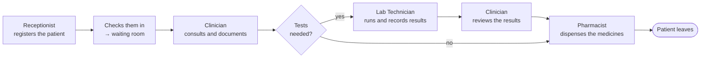

# eClinician

A multi-tenant clinic management system: one deployment serving many clinics, covering the
outpatient visit from check-in to dispensing.

**[Open the app](https://eclinician-web.onrender.com/login)** ·
[API docs](https://eclinician-api.onrender.com/swagger-ui.html) ·
[health check](https://eclinician-api.onrender.com/api/health)

> **Before presenting:** the free instance sleeps and takes 1–2 minutes to wake. Open the
> app ten minutes early and leave the tab open. Cmd-click (or Ctrl-click) links here —
> GitHub will not open them in a new tab on its own.

**Stack:** Java 21 · Spring Boot 4 · PostgreSQL 16 · Flyway · React 19 · TypeScript · Vite

## Sign in

Every account below uses the password **`demo1234`**. There is no role picker at login —
the role lives on the account and the API enforces it.

| Role | Email | Opens |
|---|---|---|
| Receptionist | `hkreceptionist@hkclinics.com` | Patients · Appointments |
| Clinician | `hkdoctor@hkclinics.com` | Patients · Appointments · Records |
| Lab Technician | `hklabtech@hkclinics.com` | Lab Results |
| Pharmacist | `hkpharmacy@hkclinics.com` | Pharmacy |
| Hospital Administrator | `hkadmin@hkclinics.com` | Staff · Clinic settings · read-only oversight |
| Platform Super Admin | `root@eclinician.com` | The hospital console — and no patient data |

## The clinical loop



Finalizing the encounter is one transaction: the visit closes and each line of the
clinician's prescriptions and lab requests becomes a row in the pharmacy and lab queues.

## How it is built

```
  React 19 SPA  ──  REST + Bearer <jwt>  ──►  Spring Boot 4 API  ──JPA──►  PostgreSQL
  React Query + Zustand                      Controller → Service → Repository
```

The tenant and the role are claims inside the signed token, never client input. Every
repository finder takes a `tenantId`, so no query can return another clinic's row. Flyway
owns the schema. 43 JUnit tests cover the rules.

## Run it

```bash
docker compose up -d   # Postgres on port 5433
make install           # npm install + mvn install
make run               # backend on :8080, frontend on :5173
make test              # 43 backend tests
```

## Docs

| Document | What is in it |
|---|---|
| [Demo script](docs/demo.md) | The 15-minute demo, step by step |
| [Presentation guide](docs/presentation.md) | Slide plan, rubric map, examiner questions with answers |
| [Vision](docs/vision.md) | Problem, stakeholders, scope, features |
| [SRS & use cases](docs/srs.md) | Use-case model, and specification against implementation |
| [Architecture & UML](docs/architecture.md) | Architecture, ERD, VOPC, sequence, state, collaboration |
| [API](docs/api.md) | Endpoints, errors, who may call what |
| [Testing](docs/testing.md) | What each test proves |
| [Deployment](docs/deployment.md) | Local, Docker, Render, migrations |
| [Roadmap](docs/roadmap.md) | What is not built, and why |

Analysis-phase originals: [SRS PDF](docs/srs/eClinician-SRS.pdf) ·
[requirements presentation](docs/srs/eClinician-Requirements-Presentation.pptx) ·
[drawio diagrams](docs/diagrams/)
