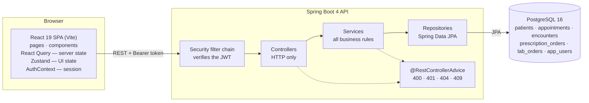
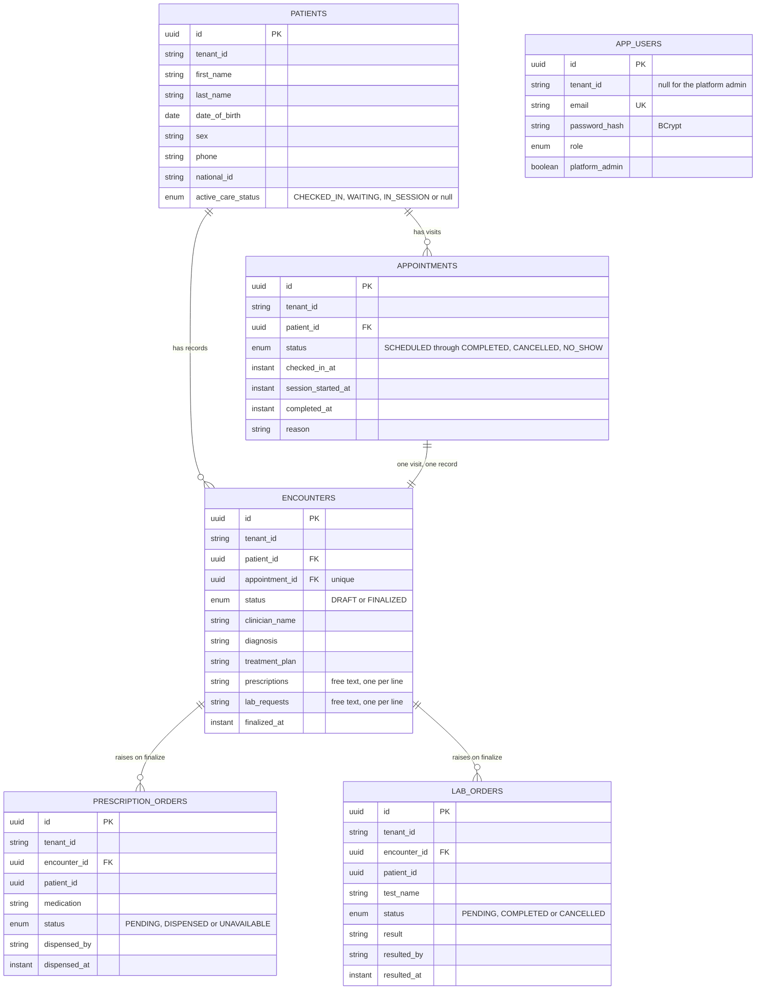
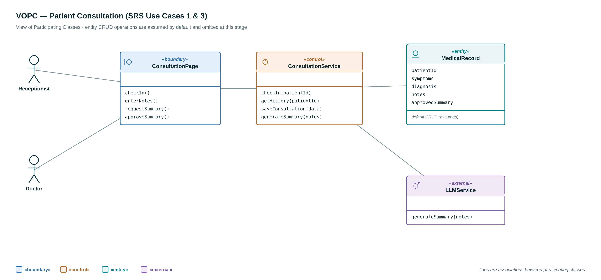
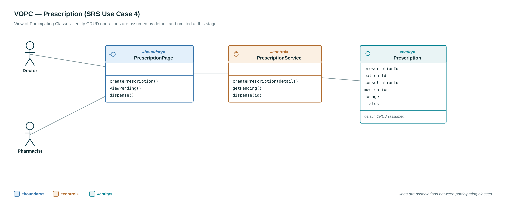
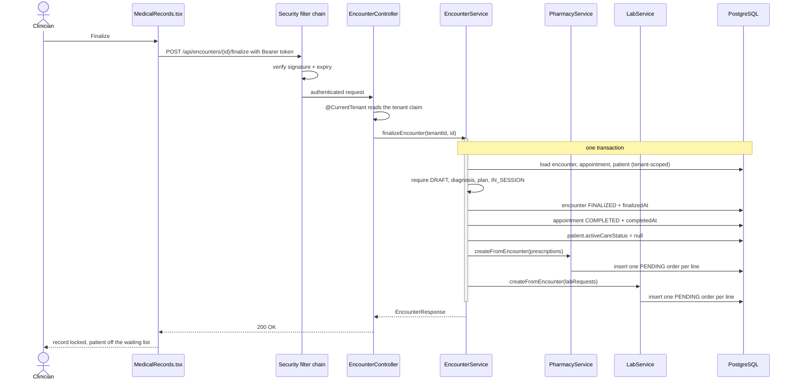
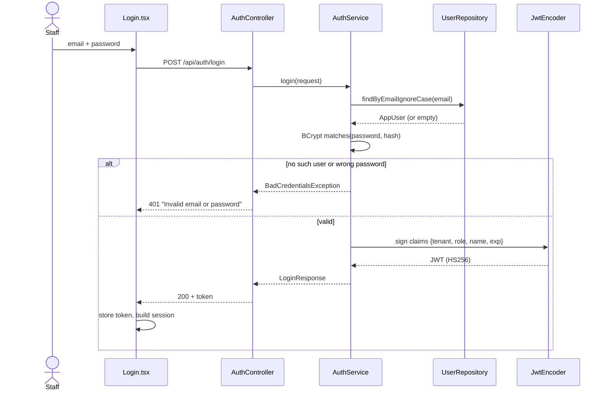
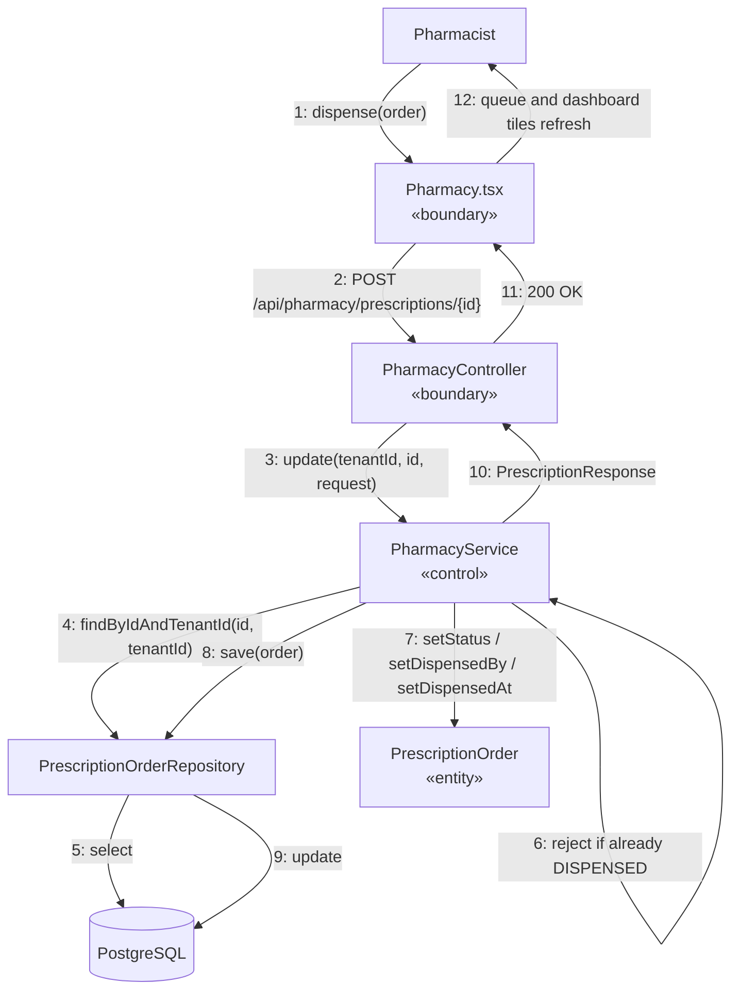

# Architecture and Design

Diagrams are Mermaid, so they render on GitHub. Every one of them describes code that
exists — file names in the diagrams are real classes.

---

## 1. System architecture



The browser holds a token; it never sends a tenant. The filter chain verifies the
signature and expiry before any controller runs, and `@CurrentTenant` lifts the tenant
out of the verified token.

## 2. Layering

```
com.eclinician
├── controllers/      HTTP only — take the tenant from the token, delegate, return a DTO
├── services/         every business rule lives here; this is what the tests point at
├── repositories/     data access, every finder tenant-scoped
├── security/         the filter chain, the signing key, and @CurrentTenant
├── domains/
│   ├── entities/     JPA classes — mutable, because Hibernate constructs then populates
│   ├── enums/        AppointmentStatus, PatientCareStatus, EncounterStatus,
│   │                 PrescriptionStatus, LabStatus, UserRole
│   └── dtos/         records — immutable, what crosses the HTTP boundary
└── web/              one @RestControllerAdvice normalizing every error
```

**Entities never cross the HTTP boundary** — request/response records do — so the
database schema and the API contract can move independently. `PrescriptionResponse`
carries a `patientName` that exists in no table; `DispenseRequest` accepts only the
three fields a pharmacist may set, so no caller can post its own `tenantId`.

**The layering trade-off, stated honestly.** Package-by-feature would let a service stay
package-private, unreachable outside its own feature. Splitting by layer means a
controller and its service sit in different packages, so **41 declarations had to become
`public`**. Navigability was worth more here than compiler-enforced module boundaries.

**Frontend — server state and UI state are kept apart.** React Query owns everything
that came from the API (caching, refetching, loading and error states); Zustand owns
purely local UI state such as filters and modal visibility. Conflating the two is the
usual source of stale-data bugs, so the split is deliberate. Files stay small and
single-purpose — the patient feature is four components (table, controls, modal, fields)
rather than one large page.

## 3. Domain model



**Two status fields track a visit, and the distinction matters.**
`AppointmentStatus` is the permanent audit trail of one visit; `PatientCareStatus` is
the patient's *current* operational state, or `null` when they have no active visit.
That second field is what makes "who is in the waiting room right now?" a single
indexed query instead of a scan over appointment history.

Relationships are held as `UUID` columns rather than JPA associations. That is a
deliberate choice: it keeps every query explicitly tenant-scoped and avoids lazy-loading
surprises across the HTTP boundary, at the cost of the database not enforcing the
foreign keys for us.

## 4. VOPC — view of participating classes

Drawn during analysis, before implementation. Sources are in
[diagrams/](diagrams/) as editable drawio files.

### Patient Consultation — SRS use cases 1 & 3



### Laboratory — SRS use case 5


### Prescription — SRS use case 4



### Analysis classes as they were built

The stereotype structure survived the implementation exactly — a boundary that only
talks HTTP, a control class holding every rule, entities holding state. The names moved:

| Analysis class | Implemented as | Note |
|---|---|---|
| `ConsultationPage` «boundary» | `MedicalRecords.tsx` + `EncounterController` | The boundary split in two once the system became a SPA plus an API |
| `ConsultationService` «control» | `EncounterService` | "Encounter" replaced "consultation" throughout; it also gained `finalizeEncounter` |
| `MedicalRecord` «entity» | `Encounter` | Gained vitals, chief complaint, examination notes, treatment plan |
| `PrescriptionPage` «boundary» | `Pharmacy.tsx` + `PharmacyController` | |
| `PrescriptionService` «control» | `PharmacyService` | Named for the department that uses it rather than the noun it stores |
| `Prescription` «entity» | `PrescriptionOrder` | One **order per medicine**, not one record per prescription — `dosage` and `frequency` were dropped for free-text lines |
| `LabPage` / `LabService` / `LabRequest` | `Laboratory.tsx` + `LabController` · `LabService` · `LabOrder` | Same shape as the pharmacy slice |
| `LLMService` «external» | — | **Not built.** The consultation VOPC anticipated an external service summarizing clinician notes; there is no LLM integration |
| — | `CurrentTenantResolver` «boundary» | Added later: lifts the tenant off the verified token so no controller reads client input for it |

The controller holds no rules and the entities hold no orchestration; everything that
decides anything is in the control classes. That is why the tests point at services.

## 5. Sequence — UC-5 Finalize encounter



If any step throws — a missing diagnosis, an appointment not in session — the
transaction rolls back and the visit stays exactly as it was. There is no state in which
the appointment is closed but the pharmacy never heard about the medicines.

## 6. Sequence — UC-0 Log in



## 7. Collaboration — UC-6 Dispense prescription

Same interaction, drawn as a communication (collaboration) diagram with numbered
messages.



Message 4 is the whole multi-tenancy story in one line: there is no
`findById(id)` on that repository, so a pharmacist at one clinic cannot reach another
clinic's order even by guessing its UUID.

## 8. Multi-tenancy, end to end

1. **Login decides the tenant.** It is read from the `app_users` row, never from input.
2. **The token carries it.** `tenant` is a claim inside an HS256-signed JWT — readable by
   anyone, changeable by nobody without the signing key.
3. **The filter chain verifies it** on every request, before any controller runs.
4. **`@CurrentTenant` injects it**, replacing the old `@RequestHeader("X-Tenant-Id")` with
   a value the caller cannot choose.
5. **Every repository finder takes it** — `findByIdAndTenantId`,
   `countByTenantIdAndStatus`. There is no query in the codebase that can return another
   tenant's row, because none of them can be called without a tenant.

`UserRepository` is the single deliberately un-scoped repository: at login there is no
tenant yet, and the email is what decides which one the caller gets.

## 8b. Authorization — what the role may do

Tenancy answers *whose data*; the role answers *which actions*.

1. **The role is a claim**, set at login from the `app_users` row.
2. **A converter turns it into an authority** — `PHARMACIST` becomes `ROLE_PHARMACIST`
   in the security context (`SecurityConfig.roleConverter`).
3. **Controllers carry `@PreAuthorize`** — `hasAnyRole('PHARMACIST','ADMINISTRATOR')` on
   dispensing, `CLINICIAN` on documenting, `RECEPTIONIST` on registration and arrival.
   A refusal is a `403` from the server, not a hidden button.
4. **Audit fields come from the token, never the body.** `@CurrentUserName` stamps
   `dispensedBy`, `resultedBy` and `clinicianName`, so a caller cannot record work under
   another person's name. The three request DTOs no longer carry a name field at all.
5. **The frontend mirrors the same table** in `ProtectedRoute` and the navigation, which
   is convenience only — the API refuses the call independently.

## 9. Why the architecture is the point

The claim "adding a module is additive, not a rewrite" was tested twice.

| Module | What it cost |
|---|---|
| Pharmacy | 1 entity, 1 repository, 2 DTOs, 1 service, 1 controller, **1 line** in `finalizeEncounter` |
| Laboratory | 1 entity, 1 repository, 2 DTOs, 1 service, 1 controller, **1 line** in `finalizeEncounter` |

Nothing in the patient, appointment or encounter code changed to accommodate either.
