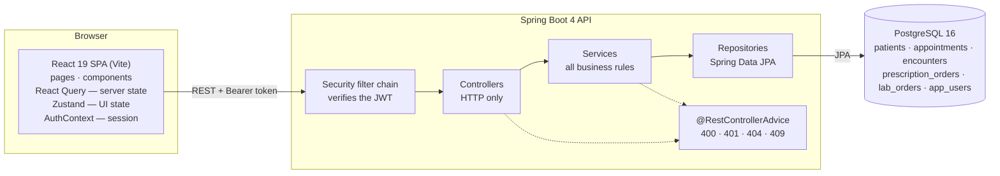
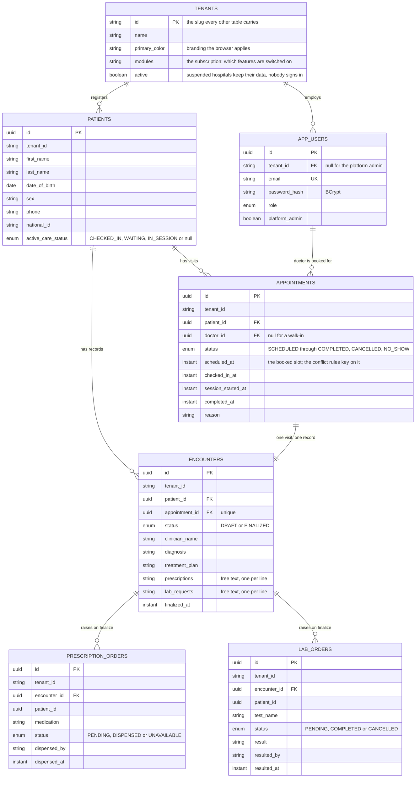
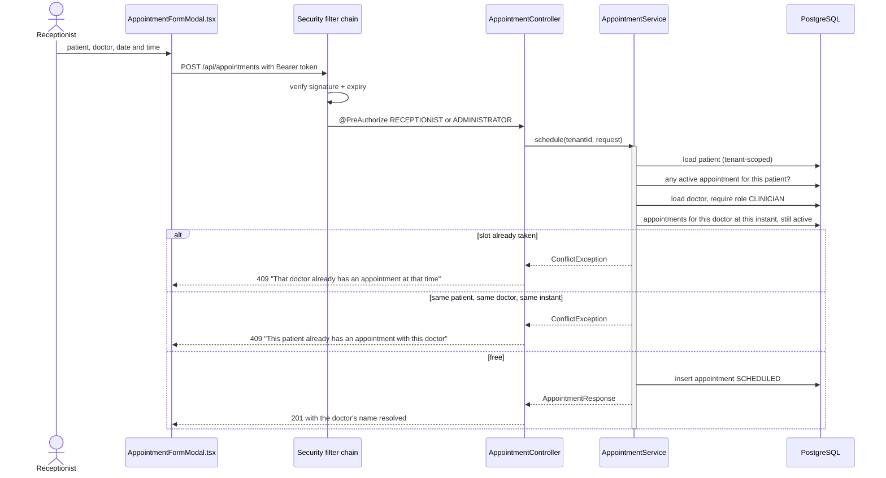
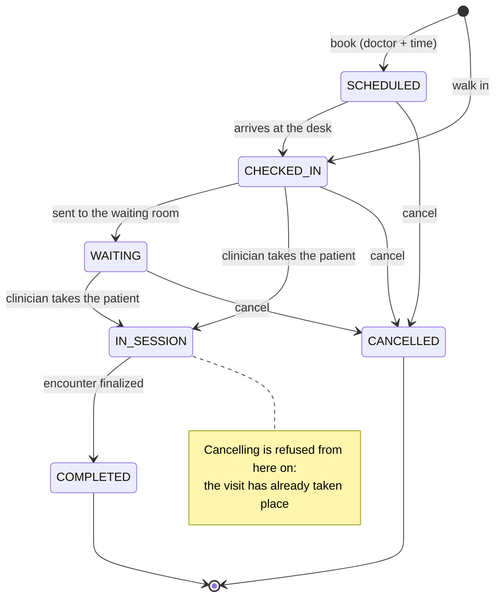
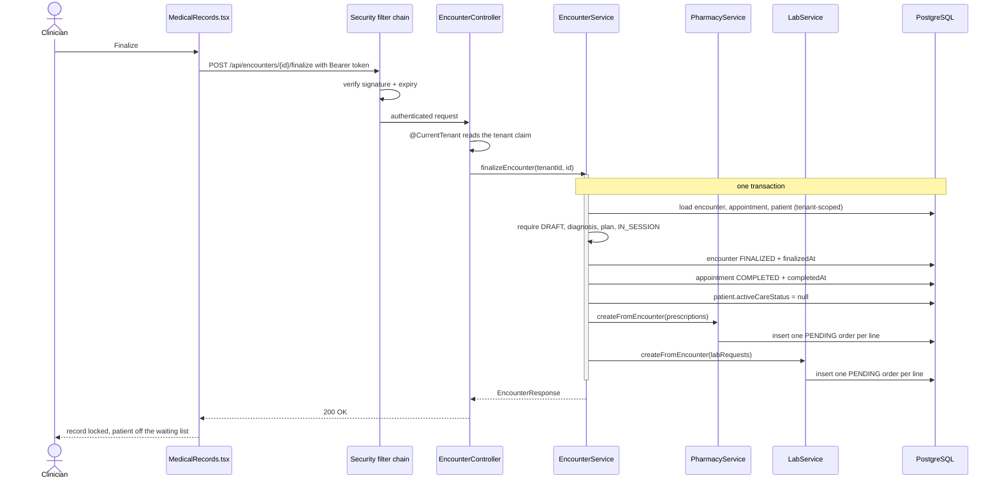
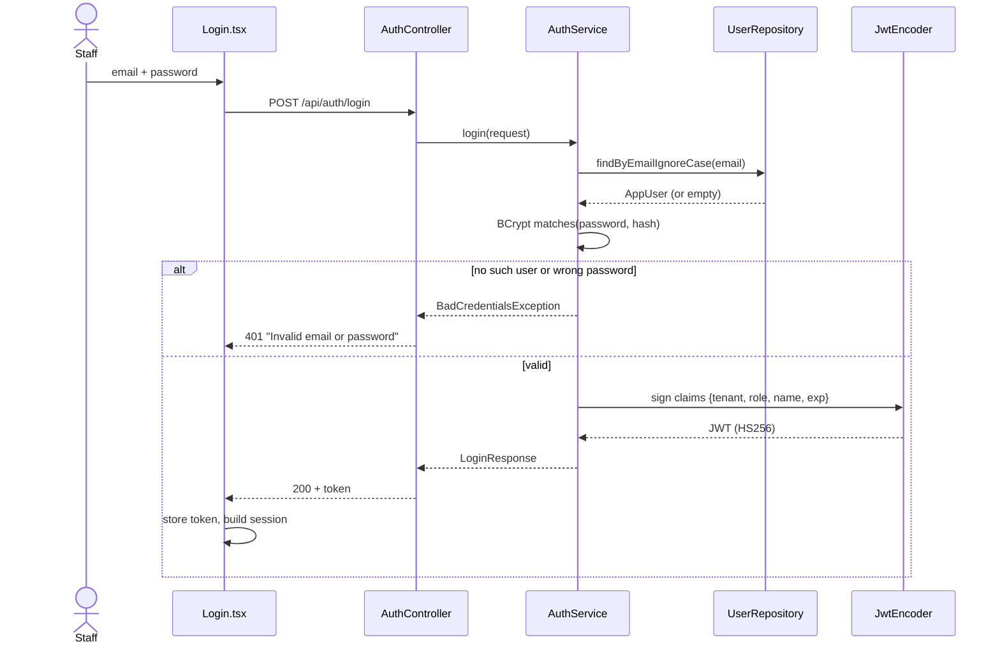
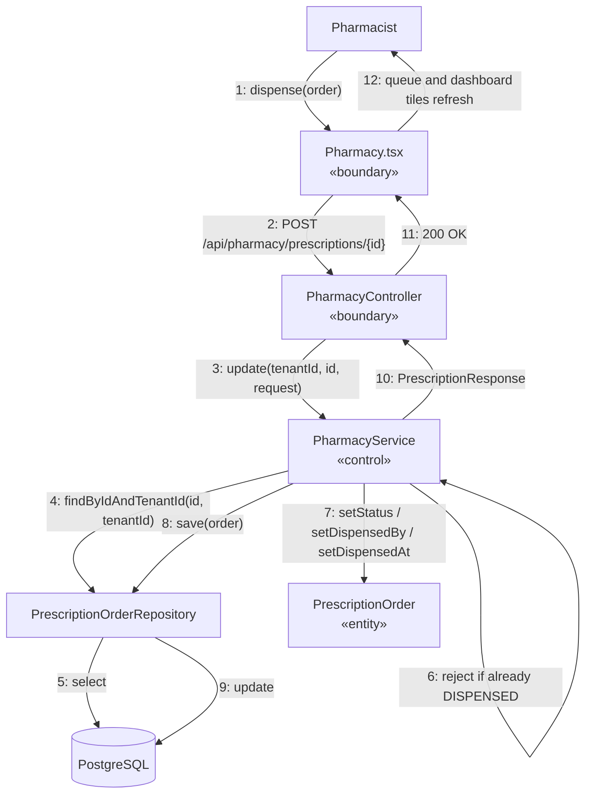
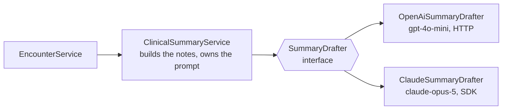

# Architecture and Design

Diagrams are Mermaid, so they render on GitHub, and every one describes code that exists —
the names in them are real classes.

---

## 1. System architecture



The browser holds a token; it never sends a tenant. The filter chain verifies the
signature and expiry before any controller runs, and `@CurrentTenant` lifts the tenant
out of the verified token.

## 2. Layering

```
com.eclinician
├── controllers/      HTTP only — take the tenant from the token, delegate, return a DTO
├── services/         every business rule lives here; this is what the tests point at
├── repositories/     data access, every finder tenant-scoped
├── security/         the filter chain, the signing key, and @CurrentTenant
├── domains/
│   ├── entities/     JPA classes — mutable, because Hibernate constructs then populates
│   ├── enums/        AppointmentStatus, PatientCareStatus, EncounterStatus,
│   │                 PrescriptionStatus, LabStatus, UserRole
│   └── dtos/         records — immutable, what crosses the HTTP boundary
└── web/              one @RestControllerAdvice normalizing every error
```

**Entities never cross the HTTP boundary** — request/response records do — so the
database schema and the API contract can move independently. `PrescriptionResponse`
carries a `patientName` that exists in no table; `DispenseRequest` accepts only the
three fields a pharmacist may set, so no caller can post its own `tenantId`.

**The layering trade-off.** Package-by-feature would keep a service package-private;
splitting by layer put controllers and services in different packages, so 41 declarations
had to become `public`. Navigability was worth more than compiler-enforced boundaries.

**Frontend.** React Query owns server state (caching, refetching, loading and error);
Zustand owns local UI state such as filters and modal visibility. Conflating the two is the
usual source of stale-data bugs. Files stay small — the patient feature is four components,
not one large page.

## 3. Domain model



**Two status fields track a visit, and the distinction matters.**
`AppointmentStatus` is the permanent audit trail of one visit; `PatientCareStatus` is
the patient's *current* operational state, or `null` when they have no active visit.
That second field is what makes "who is in the waiting room right now?" a single
indexed query instead of a scan over appointment history.

Relationships are held as `UUID` columns rather than JPA associations. That is a
deliberate choice: it keeps every query explicitly tenant-scoped and avoids lazy-loading
surprises across the HTTP boundary. It used to cost the foreign keys — the object model
knew about the relationships and the database did not. Since the schema moved to Flyway
(`backend/src/main/resources/db/migration`) the database holds them too:

| Constraint | Rule it enforces |
|---|---|
| `fk_appointments_patient`, `fk_encounters_patient` (`RESTRICT`) | A patient with visits or records cannot be deleted — SRS 1.3, now below the service as well as inside it |
| `fk_appointments_doctor` (`RESTRICT`) | A doctor's account is deactivated, never deleted, so a booked visit keeps its clinician |
| `fk_prescription_orders_encounter`, `fk_lab_orders_encounter` (`CASCADE`) | Orders belong to the record that raised them |
| `ux_patients_tenant_phone`, `ux_patients_tenant_national_id` | The two SRS uniqueness rules, per tenant, where two simultaneous registrations cannot race past the service check |

Hibernate no longer generates the schema (`ddl-auto=validate`), so a mapping that drifts
from the migrations fails at startup rather than silently altering a live table.

## 4. VOPC — view of participating classes

Drawn during analysis, before implementation. Sources are in
[diagrams/](diagrams/) as editable drawio files.

### Patient Consultation — SRS use cases 1 & 3


### Laboratory — SRS use case 5


### Prescription — SRS use case 4


### Analysis classes as they were built

The stereotype structure survived the implementation exactly — a boundary that only
talks HTTP, a control class holding every rule, entities holding state. The names moved:

| Analysis class | Implemented as | Note |
|---|---|---|
| `ConsultationPage` «boundary» | `MedicalRecords.tsx` + `EncounterController` | The boundary split in two once the system became a SPA plus an API |
| `ConsultationService` «control» | `EncounterService` | "Encounter" replaced "consultation" throughout; it also gained `finalizeEncounter` |
| `MedicalRecord` «entity» | `Encounter` | Gained vitals, chief complaint, examination notes, treatment plan |
| `PrescriptionPage` «boundary» | `Pharmacy.tsx` + `PharmacyController` | |
| `PrescriptionService` «control» | `PharmacyService` | Named for the department that uses it rather than the noun it stores |
| `Prescription` «entity» | `PrescriptionOrder` | One **order per medicine**, not one record per prescription — `dosage` and `frequency` were dropped for free-text lines |
| `LabPage` / `LabService` / `LabRequest` | `Laboratory.tsx` + `LabController` · `LabService` · `LabOrder` | Same shape as the pharmacy slice |
| `LLMService` «external» | — | **Not built.** The consultation VOPC anticipated an external service summarizing clinician notes; there is no LLM integration |
| — | `CurrentTenantResolver` «boundary» | Added later: lifts the tenant off the verified token so no controller reads client input for it |

The controller holds no rules and the entities hold no orchestration; everything that
decides anything is in the control classes. That is why the tests point at services.

## 5. Sequence — UC-2 Schedule appointment

The SRS rule the diagram exists to show: a doctor cannot hold two appointments at one
date and time. One repository call answers it, and answers the patient-duplicate rule at
the same time, because a clash with the same patient is a row in the same result.



A walk-in never reaches those branches: `checkIn` creates the appointment with no
doctor, and the check returns early when `doctorId` is null.

## 6. State — the life of one appointment

Two fields track a visit and this diagram is the reason they are different. The states
below are `AppointmentStatus`, the permanent record; `PatientCareStatus` is only the
sub-set with a box around it, which is what "who is here right now" reads.



`NO_SHOW` is the seventh value in the enum and appears in no transition above: the SRS
describes no flow that sets it, so nothing does. Leaving it visible and unreachable is
more honest than deleting it or pretending an endpoint exists.

## 7. Sequence — UC-5 Finalize encounter



If any step throws — a missing diagnosis, an appointment not in session — the
transaction rolls back and the visit stays exactly as it was. There is no state in which
the appointment is closed but the pharmacy never heard about the medicines.

## 8. Sequence — UC-0 Log in



## 9. Collaboration — UC-6 Dispense prescription

Same interaction, drawn as a communication (collaboration) diagram with numbered
messages.



Message 4 is the whole multi-tenancy story in one line: there is no
`findById(id)` on that repository, so a pharmacist at one clinic cannot reach another
clinic's order even by guessing its UUID.

## 10. Multi-tenancy, end to end

1. **Login decides the tenant.** It is read from the `app_users` row, never from input.
2. **The token carries it.** `tenant` is a claim inside an HS256-signed JWT — readable by
   anyone, changeable by nobody without the signing key.
3. **The filter chain verifies it** on every request, before any controller runs.
4. **`@CurrentTenant` injects it**, replacing the old `@RequestHeader("X-Tenant-Id")` with
   a value the caller cannot choose.
5. **Every repository finder takes it** — `findByIdAndTenantId`,
   `countByTenantIdAndStatus`. There is no query in the codebase that can return another
   tenant's row, because none of them can be called without a tenant.

`UserRepository` and `TenantRepository` are the two deliberately un-scoped repositories,
for the same reason: at login there is no tenant yet, and the email is what decides which
one the caller gets. `TenantRepository` is reachable only from the platform console.

**6. The tenant is a row, and it is what the hospital bought.** `tenants` holds the name,
the brand colour and the module subscription. Login answers with them, the browser paints
the colour and filters its navigation with them, and the platform administrator changes
them from the console:

| Column | What it decides |
|---|---|
| `name`, `primary_color` | What the hospital's staff see in the sidebar and topbar |
| `modules` | Which navigation items exist at all — the subscription |
| `active` | Suspending keeps every row and refuses every sign-in for that hospital |

The platform administrator is the one account with **no tenant**, which is exactly why
they can run the console and cannot read a patient: `@CurrentTenant` has nothing to give
a clinical controller, and every one of those endpoints answers `403`. `PlatformConsoleTests`
asserts both directions.

## 11. Authorization — what the role may do

Tenancy answers *whose data*; the role answers *which actions*.

1. **The role is a claim**, set at login from the `app_users` row.
2. **A converter turns it into an authority** — `PHARMACIST` becomes `ROLE_PHARMACIST`
   in the security context (`SecurityConfig.roleConverter`).
3. **Controllers carry `@PreAuthorize`** — `hasAnyRole('PHARMACIST','ADMINISTRATOR')` on
   dispensing, `CLINICIAN` on documenting, `RECEPTIONIST` on registration and arrival.
   A refusal is a `403` from the server, not a hidden button.
4. **Audit fields come from the token, never the body.** `@CurrentUserName` stamps
   `dispensedBy`, `resultedBy` and `clinicianName`, so a caller cannot record work under
   another person's name. The three request DTOs no longer carry a name field at all.
5. **A method-level rule beats the class-level one where it must.** `StaffController` is
   annotated `hasRole('ADMINISTRATOR')` for the whole class; `GET /api/staff/clinicians`
   overrides that to also admit a receptionist, because booking a doctor means naming
   one. It is the only widened read, and it returns names and roles — never a hash.
6. **The frontend mirrors the same table** in `ProtectedRoute` and the navigation, which
   is convenience only — the API refuses the call independently.

## 12. The summarizer, and why it is an interface

The consultation VOPC drew an external `LLMService`. It is built, and it is the one place
the system talks to something it does not control — so it is the one place worth a seam:



- **`ClinicalSummaryService` owns everything clinical**: which fields become notes, the
  prompt that forbids inventing a diagnosis or a dose, and the refusal to draft from an
  empty encounter. That logic is written once and cannot drift between vendors.
- **A `SummaryDrafter` owns one vendor's wire format** and nothing else. It never sees an
  `Encounter`, a tenant or the database — only text in, text out.
- **Which one runs is a deployment decision.** Whichever key is configured wins;
  `AI_PROVIDER` names one explicitly. Swapping vendors is an environment variable, and
  adding a third is one class.
- **Absent is a valid state.** With no key the endpoint answers `503` and every other part
  of the visit works exactly as before, which is what keeps an external dependency from
  becoming a single point of failure in a clinic.

## 13. Why the architecture is the point

The claim "adding a module is additive, not a rewrite" was tested twice.

| Module | What it cost |
|---|---|
| Pharmacy | 1 entity, 1 repository, 2 DTOs, 1 service, 1 controller, **1 line** in `finalizeEncounter` |
| Laboratory | 1 entity, 1 repository, 2 DTOs, 1 service, 1 controller, **1 line** in `finalizeEncounter` |

Nothing in the patient, appointment or encounter code changed to accommodate either.
