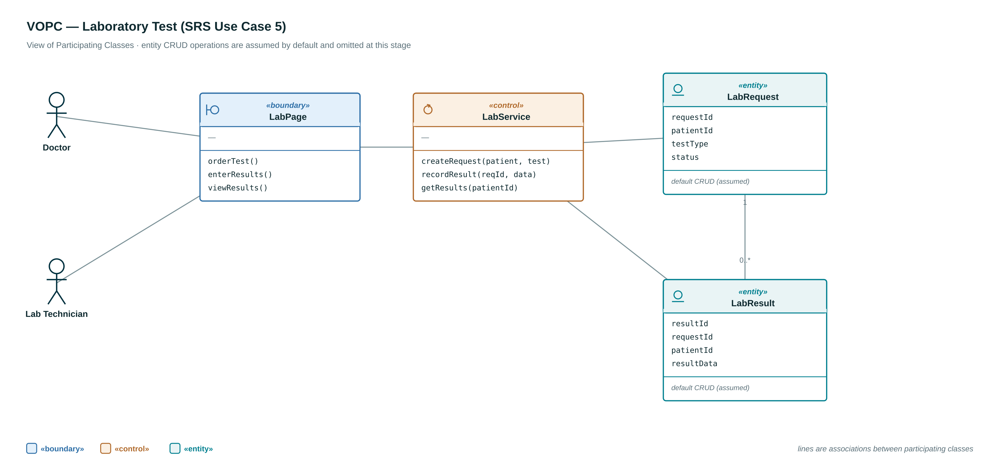
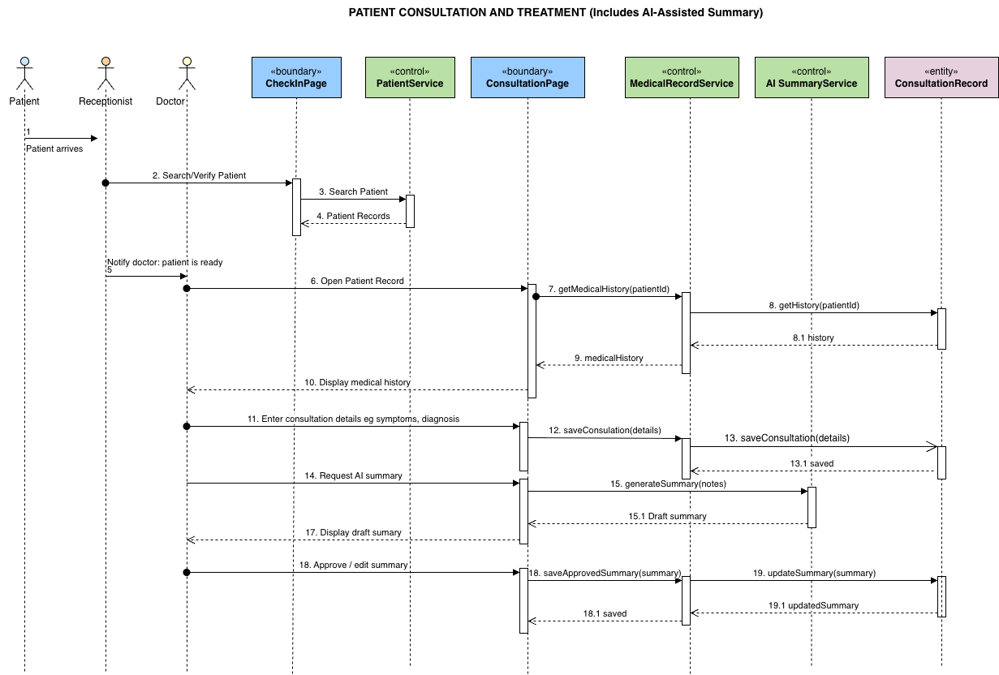
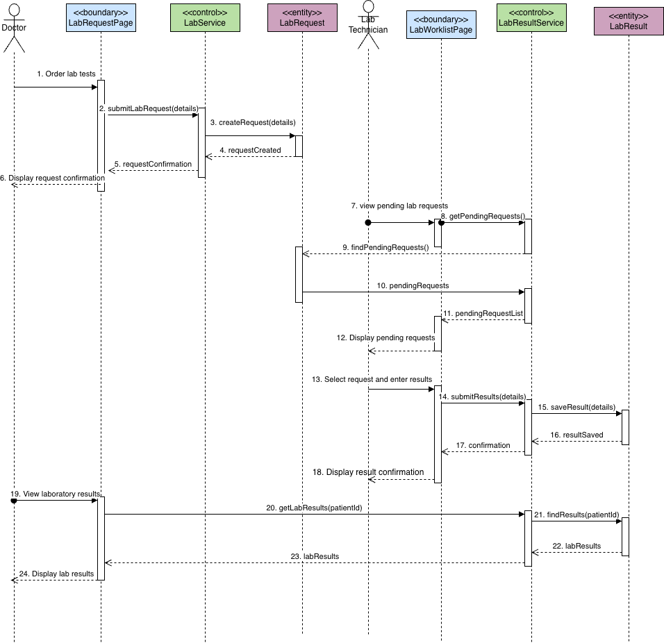
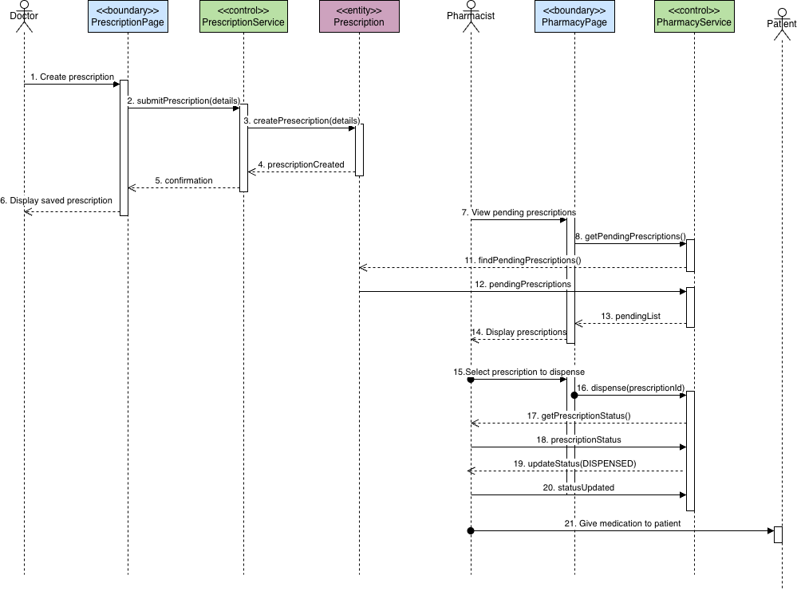
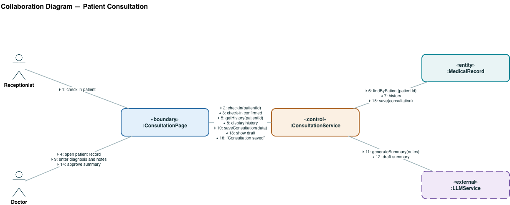
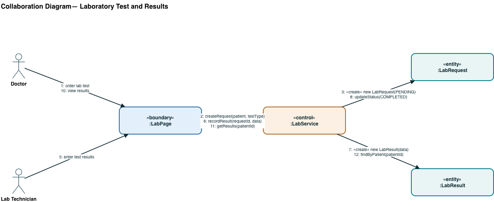
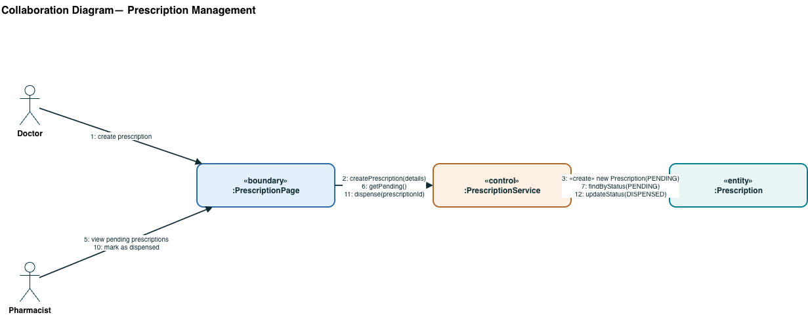

# Diagram gallery

Every UML artefact on one page, grouped by kind. Editable `.drawio` sources sit beside
their exports.

| Kind | Where |
|---|---|
| System architecture | [../architecture/](../architecture/) — the PDF, plus the diagram as `.drawio` and `.png` |
| Use case | [use-case/](use-case/) |
| VOPC | [vopc/](vopc/) |
| Sequence | [sequence/](sequence/) |
| Collaboration | [collaboration/](collaboration/) |

---

## System architecture

Three tiers — a React SPA, a Spring Boot application tier of controller → security →
service → repository, and PostgreSQL — with the AI summarizer outside the system boundary.
The written analysis is in
[eClinician-System-Architecture.pdf](../architecture/eClinician-System-Architecture.pdf).

## Use case

The system boundary with the six use-case packages and the actor that owns each. The full
use-case descriptions are in the [SRS PDF](../srs/eClinician-SRS.pdf).

## VOPC — view of participating classes

One per major use case: the boundary, control and entity classes that take part.

### 1 · Consultation

### 2 · Laboratory

### 3 · Prescription

## Sequence

Message order over time, one diagram per use case.

### Patient consultation

### Lab test request and results

### Prescription management

## Collaboration

The same interactions drawn as links between objects rather than along a timeline.

### Patient consultation

### Lab test and result

### Prescription management

