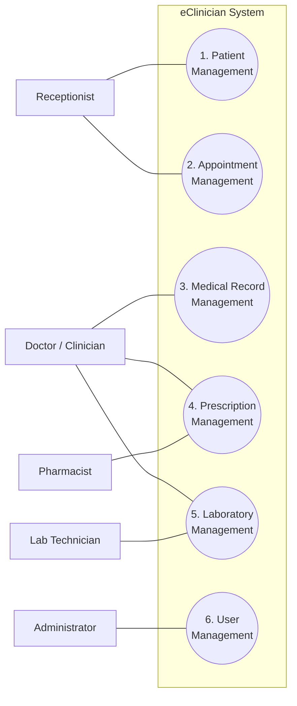

# Requirements — SRS and Use-Case Model

The authoritative requirements document is the use-case-based SRS written during the
analysis phase:

| Document | File |
|---|---|
| **SRS (use-case model + use-case descriptions)** | [srs/eClinician-SRS.pdf](srs/eClinician-SRS.pdf) · [.docx](srs/eClinician-SRS.docx) |
| Requirements presentation | [srs/eClinician-Requirements-Presentation.pptx](srs/eClinician-Requirements-Presentation.pptx) |
| Use-case diagram (source) | [diagrams/eclinician-use-case.drawio](diagrams/eclinician-use-case.drawio) |

This page summarizes that model and — the part worth reading before the demo — records
**where the built system differs from what was specified**, and why.

---

## 1. Actors

| Actor | Responsibility (from the SRS) |
|---|---|
| **Receptionist** | Registers patients and manages appointments |
| **Doctor / Clinician** | Records consultations, prescribes, requests labs |
| **Pharmacist** | Views prescriptions and dispenses medication |
| **Lab Technician** | Records and reports laboratory results |
| **Administrator** | Manages system users and their roles |

## 2. Use-case model

The diagram below mirrors [eclinician-use-case.drawio](diagrams/eclinician-use-case.drawio)
so it renders inline on GitHub; the drawio file remains the source.

## 3. Use cases and business rules

| # | Use case | Actors | Basic flows | Key business rules |
|---|---|---|---|---|
| 1 | Patient Management | Receptionist | Create · view · update · delete profile | No duplicate patients — identified by patient ID, phone, or national ID/passport. A profile linked to appointments, records or prescriptions cannot be deleted. The national ID field is not editable after creation. |
| 2 | Appointment Management | Receptionist | Schedule · view · update · cancel | A doctor cannot hold two appointments at the same date and time; no duplicate patient appointments. An appointment that already took place cannot be cancelled. |
| 3 | Medical Record Management | Doctor / Clinician | Create consultation record · view patient history · update record | Only clinicians create or update records; every record links to an existing patient. |
| 4 | Prescription Management | Doctor, Pharmacist | Create prescription · view · dispense medication | Only doctors issue prescriptions; only pharmacists dispense. A prescription links to a patient and a consultation. |
| 5 | Laboratory Management | Doctor, Lab Technician | Create request · view request · record results · view results | Results must link to a request; only lab technicians record results; doctors view their patients' results. |
| 6 | User Management | Administrator | Create · view · update · delete/deactivate user | No duplicate accounts; email must be unique; users access only role-permitted features. |

Full step-by-step flows, preconditions and postconditions for every basic flow are in the
[SRS PDF](srs/eClinician-SRS.pdf).

---

## 4. As-built: specification against implementation

Analysis was done before a line of code; the implementation then made its own decisions.
Both are shown here rather than quietly reconciled.

| # | Use case | Built? | Where | Deviation from the SRS |
|---|---|---|---|---|
| 1 | Patient Management | ✅ Full CRUD | `PatientController` · `/api/patients` | **The duplicate rule is not enforced** — two patients may share a phone or national ID. Deletion is likewise not guarded against linked records. Both are validation the service layer does not yet do. |
| 2 | Appointment Management | ⚠️ Reshaped | `AppointmentController` · `/api/appointments` | The SRS specifies *scheduling* — a doctor, a date, a time, conflict checks. The system instead models **arrival**: check in → waiting → in session → completed, with a reason. The `CANCELLED` and `NO_SHOW` statuses exist in the enum but no endpoint sets them. This is the largest deviation, and a deliberate one: for a walk-in outpatient clinic, who is waiting *now* mattered more than who is booked for Thursday. |
| 3 | Medical Record Management | ✅ Plus more | `EncounterController` · `/api/encounters` | Called an **encounter** rather than a consultation record, and carries more than the SRS listed: vitals, chief complaint, examination notes, treatment plan. Adds **finalization**, which the SRS does not describe — the act that closes the visit and raises pharmacy and lab work. |
| 4 | Prescription Management | ✅ Reshaped | `PharmacyController` · `/api/pharmacy/prescriptions` | Prescriptions are **free text, one medicine per line**, split into one order per line when the encounter is finalized — not a form with dosage, frequency and duration fields. Adds an `UNAVAILABLE` status the SRS did not anticipate, because a pharmacy that cannot supply a medicine still has to record that. |
| 5 | Laboratory Management | ✅ Reshaped | `LabController` · `/api/lab/orders` | Same shape as prescriptions: lab requests are free text, one test per line, raised at finalization. Results are free text. "View results by patient" is not built — results are read from the lab queue. Adds `CANCELLED` for a test that cannot be run. |
| 6 | User Management | ⚠️ Partial | `AppUser` · `UserSeeder` · `/api/auth/login` | Accounts, roles and password hashes exist and are seeded, and **authentication was added beyond the SRS** (which assumed login as a precondition without specifying it). What is missing is the administrator's UI to create, edit or deactivate an account. |
| — | Role-permitted access | ⚠️ Partial | `SecurityConfig` | Every endpoint requires a valid token, and the frontend hides what a role should not see. Server-side enforcement *per role* is not there yet: any authenticated user of a clinic can call any of its endpoints. Tracked in [roadmap.md](roadmap.md). |
| — | `LLMService` (VOPC 1) | ❌ Not built | — | The consultation VOPC includes an external service generating a summary from the clinician's notes. No LLM integration exists; the clinician writes the record themselves. |

### Requirement added during implementation

**Multi-tenancy.** The SRS describes one clinic. The implementation carries a tenant on
every row and every query, so one deployment serves many independent clinics — the
commercial argument in [vision.md](vision.md), and the property proven by `AuthTests` in
[testing.md](testing.md).

## 5. Non-functional requirements

These were not itemized in the SRS; they are recorded here because the implementation
answers them explicitly.

| ID | Requirement | How it is met |
|---|---|---|
| NFR-1 | **Isolation** — one clinic's data unreachable by another | Tenant is a signed token claim; every repository finder takes `tenantId`; proven by `AuthTests` |
| NFR-2 | **Password security** | BCrypt hashes; the plain password is never stored or logged |
| NFR-3 | **Secret handling** | `JWT_SECRET` comes from the environment, generated per deployment |
| NFR-4 | **Consistency** — a visit must never be half-closed | Finalization is one `@Transactional` method |
| NFR-5 | **Referential integrity** (SRS business rule) | Orders carry `encounterId` and `patientId`; encounters carry `appointmentId` (unique) |
| NFR-6 | **Portability** | Docker Compose locally; a Render blueprint in the cloud |
| NFR-7 | **Testability** | Rules tested against in-memory H2, no database needed in CI |
| NFR-8 | **Maintainability** | Proven twice: pharmacy, then lab, each one line inside `finalizeEncounter` |
| NFR-9 | **Error clarity** | One `@RestControllerAdvice` maps 400/401/404/409 |
