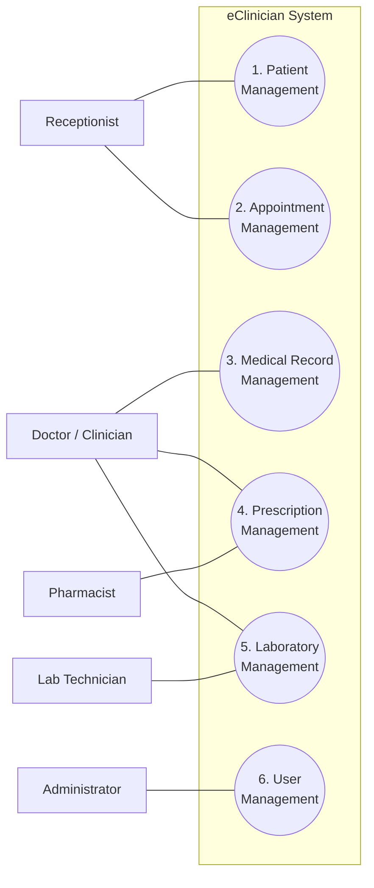

# Requirements — SRS and Use-Case Model

The authoritative requirements document is the use-case-based SRS written during the
analysis phase:

| Document | File |
|---|---|
| **SRS (use-case model + use-case descriptions)** | [srs/eClinician-SRS.pdf](srs/eClinician-SRS.pdf) · [.docx](srs/eClinician-SRS.docx) |
| Requirements presentation | [srs/eClinician-Requirements-Presentation.pptx](srs/eClinician-Requirements-Presentation.pptx) |
| Use-case diagram (source) | [diagrams/eclinician-use-case.drawio](diagrams/eclinician-use-case.drawio) |

This page summarizes that model and records **where the built system differs from what was
specified**, and why.

---

## 1. Actors

| Actor | Responsibility (from the SRS) |
|---|---|
| **Receptionist** | Registers patients and manages appointments |
| **Doctor / Clinician** | Records consultations, prescribes, requests labs |
| **Pharmacist** | Views prescriptions and dispenses medication |
| **Lab Technician** | Records and reports laboratory results |
| **Administrator** | Manages system users and their roles |

## 2. Use-case model

The diagram below mirrors [eclinician-use-case.drawio](diagrams/eclinician-use-case.drawio)
so it renders inline on GitHub; the drawio file remains the source.

## 3. Use cases and business rules

| # | Use case | Actors | Basic flows | Key business rules |
|---|---|---|---|---|
| 1 | Patient Management | Receptionist | Create · view · update · delete profile | No duplicate patients — identified by patient ID, phone, or national ID/passport. A profile linked to appointments, records or prescriptions cannot be deleted. The national ID field is not editable after creation. |
| 2 | Appointment Management | Receptionist | Schedule · view · update · cancel | A doctor cannot hold two appointments at the same date and time; no duplicate patient appointments. An appointment that already took place cannot be cancelled. |
| 3 | Medical Record Management | Doctor / Clinician | Create consultation record · view patient history · update record | Only clinicians create or update records; every record links to an existing patient. |
| 4 | Prescription Management | Doctor, Pharmacist | Create prescription · view · dispense medication | Only doctors issue prescriptions; only pharmacists dispense. A prescription links to a patient and a consultation. |
| 5 | Laboratory Management | Doctor, Lab Technician | Create request · view request · record results · view results | Results must link to a request; only lab technicians record results; doctors view their patients' results. |
| 6 | User Management | Administrator | Create · view · update · delete/deactivate user | No duplicate accounts; email must be unique; users access only role-permitted features. |

Full step-by-step flows, preconditions and postconditions for every basic flow are in the
[SRS PDF](srs/eClinician-SRS.pdf).

---

## 4. As-built: specification against implementation

Analysis came before any code; the implementation then made its own decisions. Both are
shown here rather than quietly reconciled.

| # | Use case | Built? | Where | Deviation from the SRS |
|---|---|---|---|---|
| 1 | Patient Management | ✅ Full CRUD | `PatientController` | Matches the specification, all three business rules included. A patient registered without a national ID may still have it filled in later — the field is unwritable, not permanently empty. |
| 2 | Appointment Management | ✅ Both models | `AppointmentController` | Scheduling as specified, plus the **arrival** model the clinic runs on: check in → waiting → in session → completed. "Cannot cancel an appointment that has taken place" is read as *has started or finished*. `NO_SHOW` stays unused — no SRS flow sets it. |
| 3 | Medical Record Management | ✅ Plus more | `EncounterController` | Called an **encounter**, and carries more than the SRS listed: vitals, chief complaint, examination notes, treatment plan. Adds **finalization** — the act that closes the visit and raises pharmacy and lab work. |
| 4 | Prescription Management | ✅ Reshaped | `PharmacyController` | Free text, one medicine per line, split into one order per line at finalization — not a form with dosage fields. Adds `UNAVAILABLE`, because a pharmacy that cannot supply a medicine still has to record that. |
| 5 | Laboratory Management | ✅ Reshaped | `LabController` | Same shape as prescriptions. "View results by patient" is built — the clinician reads them on the patient record, not through the technician's queue. Adds `CANCELLED` for a test that cannot be run. |
| 6 | User Management | ✅ Built, and narrowed | `StaffController` | **Deactivation rather than deletion**, so work an account recorded keeps its author. The administrator is narrower than the SRS implies: they read every department but change no clinical row. Authentication itself was added — the SRS assumed login without specifying it. |
| — | Role-permitted access | ✅ Built | `SecurityConfig` · `@PreAuthorize` | Enforced on the server: the role is a token claim and each endpoint names the roles it accepts. The one widened read is `/api/staff/clinicians` — a receptionist cannot book a doctor they cannot name. |
| — | `LLMService` (VOPC 1) | ✅ Built | `ClinicalSummaryService` | The external summarizer the consultation VOPC drew. It drafts into an editable field, so the record stays the clinician's, and the prompt forbids inventing a diagnosis, medicine or dose. No key committed; without one the endpoint answers `503`. |

### Requirement added during implementation

**Multi-tenancy.** The SRS describes one clinic. Every row and every query carries a
tenant, so one deployment serves many — the argument in [vision.md](vision.md), proven by
`AuthTests`.

**A platform administrator above the six actors.** Selling to many hospitals needs somebody
who onboards them, sets what each bought, and can suspend one — without reading anyone's
clinical data. That account holds no tenant, which is what makes the second half true.

## 5. Non-functional requirements

Not itemized in the SRS, but the implementation answers them explicitly.

| ID | Requirement | How it is met |
|---|---|---|
| NFR-1 | **Isolation** — one clinic's data unreachable by another | Tenant is a signed token claim; every repository finder takes `tenantId`; proven by `AuthTests` |
| NFR-2 | **Password security** | BCrypt hashes; the plain password is never stored or logged |
| NFR-3 | **Secret handling** | `JWT_SECRET` comes from the environment, generated per deployment |
| NFR-4 | **Consistency** — a visit must never be half-closed | Finalization is one `@Transactional` method |
| NFR-5 | **Referential integrity** (SRS business rule) | Orders carry `encounterId` and `patientId`; encounters carry `appointmentId` (unique) |
| NFR-6 | **Portability** | Docker Compose locally; a Render blueprint in the cloud |
| NFR-7 | **Testability** | Rules tested against in-memory H2, no database needed in CI |
| NFR-8 | **Maintainability** | Proven twice: pharmacy, then lab, each one line inside `finalizeEncounter` |
| NFR-9 | **Error clarity** | One `@RestControllerAdvice` maps 400/401/404/409 |

### Where the implementation is stricter than the SRS

- **A patient may hold only one open appointment at a time.** The SRS forbids only
  duplicates with the same doctor at the same time; the stricter rule is what makes
  check-in unambiguous, and cancellation is the way out of it.
- **The doctor conflict check keys on the exact instant**, not an overlapping window —
  appointments carry no duration, so an overlap has nothing to compute from.
